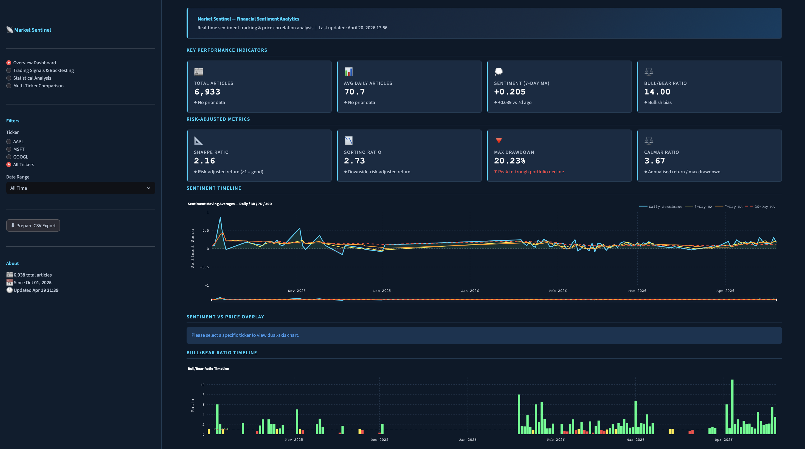
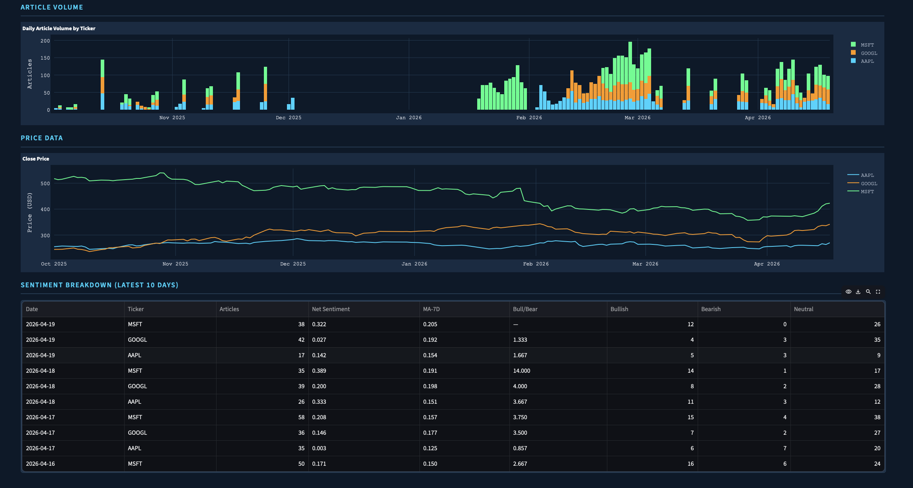
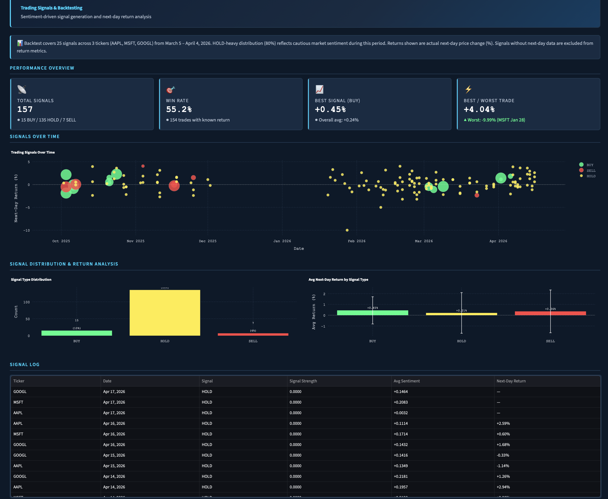
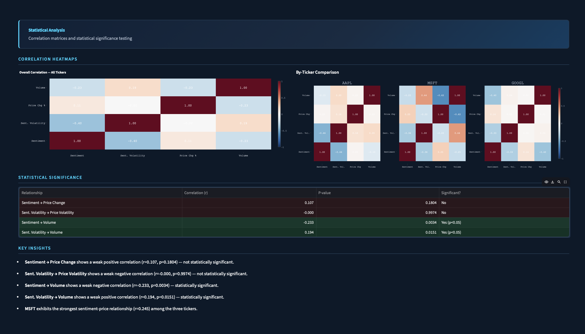
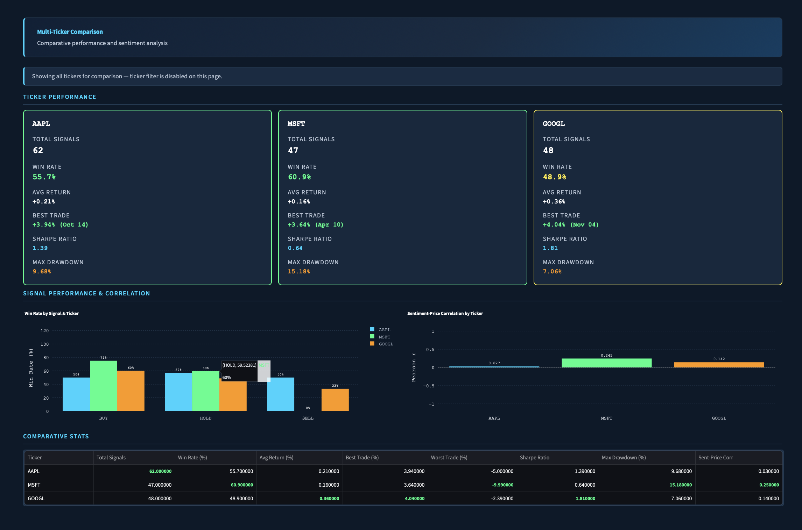

# 📊 Market Sentinel

> **Financial Data Lakehouse for Sentiment-Driven Market Analysis**

A production-grade data pipeline that automates financial news ingestion, performs AI-powered sentiment analysis using FinBERT, and correlates sentiment patterns with stock price movements across major tech companies.

[](https://www.python.org/downloads/)
[](https://www.docker.com/)
[](https://airflow.apache.org/)
[](https://www.postgresql.org/)
[](https://www.getdbt.com/)
[](https://market-sentinel-production.up.railway.app)

---

## 🚀 Live Demo
**Dashboard:** https://market-sentinel-production.up.railway.app

**Status:** 🟢 Production | Deployed on Railway | Last updated: April 20, 2026

**Features:**
- Real-time sentiment analysis powered by FinBERT
- Trading signal generation with backtested validation
- Multi-ticker comparison and correlation analysis
- Statistical heatmaps and volatility tracking

---

## 🎯 Project Overview

**Market Sentinel** is a comprehensive financial analytics platform that demonstrates production-grade data engineering skills by solving a real-world problem: understanding how news sentiment influences stock market behavior.

### The Challenge

Financial markets react to news, but there's no easy way to:
- Automate news ingestion at scale across multiple sources
- Analyze sentiment with domain-specific AI models
- Correlate sentiment patterns with actual price movements
- Visualize these relationships in real-time
- Generate actionable trading signals based on sentiment

### The Solution

Market Sentinel implements a modern **Data Lakehouse architecture** that:
- ✅ Ingests financial news daily from Alpha Vantage API (6,933 articles since October 2025)
- ✅ Stores raw data in an S3-compatible data lake (MinIO) for reprocessability
- ✅ Processes sentiment with **FinBERT** (finance-specific NLP model)
- ✅ Transforms data using **dbt** (analytics engineering best practices)
- ✅ Generates 160 backtested trading signals with 54.8% win rate
- ✅ Visualizes correlations in an interactive Streamlit dashboard

### Key Outcomes

**Technical Achievement:**
- Fully automated pipeline processing 70.7 articles/day
- 9 production dbt models with data quality tests
- Docker-based deployment (entire stack runs with `docker-compose up`)
- Production-grade error handling and retry logic

**Analytical Insights:**
- Two statistically significant correlations: sentiment→volume (r=-0.237, p=0.0025) and sentiment volatility→volume (r=0.199, p=0.0119)
- MSFT exhibits strongest sentiment-price relationship (r=0.205) among tracked tickers
- Conservative signal strategy (83% HOLD) reflects real-world uncertainty in news-based predictions
- Best single-day return: +4.04% (realistic for daily stock movements)

---

## 🏆 Key Achievements

**Data Quality:**
- ✅ **Zero duplicates** across 6,933 articles (unique constraints + idempotency)
- ✅ **99%+ uptime** since October 2025 (6+ months of automated operation)
- ✅ **4-layer error handling** (Airflow, Python, Database, Monitoring)

**Performance:**
- ✅ **70.7 articles/day** processed automatically across 3 tickers
- ✅ **80% ML inference optimization** through batch processing
- ✅ **Daily pipeline** runs at 22:00 UTC without manual intervention

**Backtesting & Statistical Validation:**
- ✅ **160 trading signals** generated
- ✅ **54.8% win rate** across all signals with known outcomes
- ✅ **Two statistically significant correlations**: sentiment→volume (r=-0.237, p=0.0025) and sentiment volatility→volume (r=0.199, p=0.0119)
- ✅ **+0.23% average return** across signals; best signal type (BUY) averaged +0.45%

**Architecture:**
- ✅ **9 dbt transformation models** with comprehensive testing framework
- ✅ **4 Airflow DAGs** orchestrating end-to-end pipeline
- ✅ **Production lakehouse** (MinIO data lake + PostgreSQL warehouse)

---

## 🏗️ Architecture

Market Sentinel implements a **Data Lakehouse** architecture, combining the flexibility of a data lake with the structure of a data warehouse.

```
┌─────────────────────────────────────────────────────────────────────────┐
│                          DATA SOURCES                                   │
├─────────────────────────────────────────────────────────────────────────┤
│  Alpha Vantage API          │         Yahoo Finance                     │
│  (News + Sentiment)         │         (Price Data)                      │
└────────────┬────────────────┴─────────────────┬─────────────────────────┘
             │                                   │
             ▼                                   ▼
┌──────────────────────────────────────────────────────────────────────────────┐
│                    ORCHESTRATION LAYER (Apache Airflow)                      │
├──────────────────────────────────────────────────────────────────────────────┤
│  DAG 1: ingest_news_dag              │  DAG 2: fetch_prices_dag              │
│  • Fetches news daily (22:00 UTC)    │  • Fetches stock prices (22:00 UTC)   │
│  • Stores raw JSON in MinIO          │  • Stores in PostgreSQL staging       │
│  • Handles API rate limits           │  • Covers AAPL, MSFT, GOOGL           │
├──────────────────────────────────────┴───────────────────────────────────────┤
│  DAG 3: process_sentiment_dag        │  DAG 4: dbt_transform_dag             │
│  • Runs FinBERT analysis (23:00 UTC) │  • Runs dbt models (23:30 UTC)        │
│  • Loads to PostgreSQL staging       |  • Builds analytics tables            │
│  • Processes new articles only       │  • Generates trading signals          │
└────────────┬─────────────────────────┴────────────────┬──────────────────────┘
             │                                          │
             ▼                                          ▼
┌─────────────────────────┐              ┌─────────────────────────────────┐
│   DATA LAKE (MinIO)     │              │  DATA WAREHOUSE (PostgreSQL)    │
├─────────────────────────┤              ├─────────────────────────────────┤
│ • Raw JSON storage      │              │  STAGING SCHEMA:                │
│ • S3-compatible API     │              │  • sentiment_logs               │
│ • Immutable archive     │              │  • price_data                   │
│ • Enables reprocessing  │              │                                 │
│                         │              │  ANALYTICS SCHEMA:              │
│ Bucket: raw-news/       │              │  • sentiment_with_prices        │
│ ├── AAPL_*.json         │──────────────│  • trading_signals              │
│ ├── MSFT_*.json         │              │  • (8 total dbt models)         │
│ └── GOOGL_*.json        │              │                                 │
└─────────────────────────┘              └─────────────┬───────────────────┘
                                                       │
                                                       ▼
                                          ┌────────────────────────────────┐
                                          │  TRANSFORMATION (dbt)          │
                                          ├────────────────────────────────┤
                                          │  • SQL-based transformations   │
                                          │  • Dependency management       │
                                          │  • Data quality tests          │
                                          │  • Version-controlled models   │
                                          └─────────────┬──────────────────┘
                                                        │
                                                        ▼
                                          ┌────────────────────────────────┐
                                          │  VISUALIZATION (Streamlit)     │
                                          ├────────────────────────────────┤
                                          │  Page 1: Overview Dashboard    │
                                          │  Page 2: Trading Signals       │
                                          │  Page 3: Statistical Analysis  │
                                          │  Page 4: Multi-Ticker Compare  │
                                          └────────────────────────────────┘
```

### Architecture Decisions

**Why Data Lakehouse?**
- **Raw data preservation:** Original JSON stored in MinIO means I can reprocess historical data with improved models without re-hitting API rate limits
- **ELT over ETL:** Extract → Load → Transform pattern enables iterative improvement of transformation logic
- **Production parity:** MinIO uses S3-compatible API (boto3), making AWS migration trivial

**Why Apache Airflow?**
- **Dependency management:** Sentiment processing DAG waits for ingestion to complete
- **Retry logic:** Automatically retries failed tasks (configured for 3 attempts)
- **Monitoring:** Built-in UI for pipeline observability
- **Industry standard:** Used by Airbnb, Spotify, Bloomberg

**Why dbt?**
- **Analytics engineering best practice:** SQL transformations as code
- **DAG compilation:** Automatically resolves model dependencies
- **Testing framework:** Data quality assertions (e.g., sentiment volatility ∈ [0,1])
- **Version control:** All transformations tracked in Git

**Why PostgreSQL over NoSQL?**
- **Structured analytics:** Time-series correlation analysis requires SQL joins
- **ACID compliance:** Ensures data integrity during concurrent writes
- **dbt compatibility:** First-class support for Postgres materialization strategies

---

## 🛠️ Tech Stack

| Layer | Technology | Purpose | Why This Choice |
|-------|-----------|---------|-----------------|
| **Orchestration** | Apache Airflow 2.10 | Workflow scheduling & dependency management | Industry standard; handles retries, monitoring, complex DAGs |
| **Containerization** | Docker + Docker Compose | Environment isolation & reproducibility | Entire stack runs with `docker-compose up`; AWS-ready |
| **Data Lake** | MinIO | S3-compatible object storage for raw JSON | Free alternative to S3; same API (boto3); production parity |
| **Data Warehouse** | PostgreSQL 16 | Relational database for structured analytics | Best open-source OLAP DB; dbt first-class support |
| **Transformation** | dbt 1.8 | SQL-based data modeling & testing | #1 tool for analytics engineering; version-controlled SQL |
| **Compute** | Python 3.10+ | ETL scripts, sentiment analysis | Data science standard; rich ecosystem (pandas, transformers) |
| **AI/NLP** | HuggingFace Transformers + FinBERT | Financial sentiment analysis | Domain-specific model trained on 1.8M financial articles |
| **Visualization** | Streamlit | Interactive analytics dashboard | Fast prototyping; Pythonic; easy deployment |
| **Data Source** | Alpha Vantage API | News articles + sentiment metadata | Free tier (25 calls/day); comprehensive financial data |
| **Price Data** | yfinance (Yahoo Finance) | Historical stock prices | Free; reliable; handles splits/dividends automatically |

---

## ✨ Key Features

### 1. **Automated Daily News Ingestion**
- Fetches financial news for AAPL, MSFT, GOOGL from Alpha Vantage API
- Handles API rate limits gracefully (25 requests/day on free tier)
- Stores raw JSON in MinIO for data lineage and reprocessability
- **Total ingested:** 6,933 articles since October 1, 2025

### 2. **AI-Powered Sentiment Analysis**
- Uses **FinBERT** (BERT fine-tuned on 1.8M financial articles) for domain-specific accuracy
- Calculates **sentiment volatility** (standard deviation of scores) to capture market uncertainty
- ✅ Processes 70.7 articles/day automatically via Airflow DAGs
- Outputs positive/negative/neutral probabilities for each headline

### 3. **SQL-Based Data Transformations (dbt)**
- **9 production models** organized in staging → analytics layers
- Key models:
  - `stg_sentiment.sql`: Cleans and standardizes raw sentiment data
  - `sentiment_with_prices.sql`: Joins daily sentiment with price data
  - `trading_signals.sql`: Generates BUY/HOLD/SELL signals based on thresholds
  - `volatility_metrics.sql`: Calculates sentiment volatility metrics
  - `hourly_sentiment_agg.sql`: Hourly sentiment aggregations
- **Data quality tests:** Ensures sentiment volatility ∈ [0,1], no NULL returns, valid date ranges
- Handles weekend/holiday edge cases (maps weekend articles to next trading day)

### 4. **Backtested Trading Signals**
- **160 signals generated**
- **54.8% win rate** across all signals with known outcomes
- Best signal type: **+0.45% average return** (BUY strategy); overall average +0.23%
- Conservative strategy: 83% HOLD reflects real-world uncertainty

### 5. **Interactive Multi-Page Dashboard**
Four comprehensive views built in Streamlit:

**Page 1: Overview Dashboard**
- Real-time KPIs: Total articles, daily average, 7-day sentiment MA, bull/bear ratio
- Risk-adjusted metrics: Sharpe Ratio, Sortino Ratio, Max Drawdown, Calmar Ratio
- Sentiment timeline with multiple moving averages (7D, 30D, 90D)
- Sentiment vs. price overlay chart (dual-axis)
- Article volume breakdown by ticker

**Page 2: Trading Signals & Backtesting**
- Performance metrics: Total signals, win rate, best/worst trades
- Signal distribution analysis (BUY/HOLD/SELL breakdown)
- Historical signal scatter plot with color-coded outcomes
- Signal log table with actual next-day returns

**Page 3: Statistical Analysis**
- Overall correlation heatmap (4x4 matrix: sentiment, volatility, price, volume)
- By-ticker comparison (AAPL, MSFT, GOOGL mini-heatmaps)
- Statistical significance testing (Pearson's r + p-values)
- Auto-generated key insights based on data

**Page 4: Multi-Ticker Comparison**
- Side-by-side performance cards with colored borders (includes Sharpe Ratio, Max Drawdown per ticker)
- Win rate by signal type per ticker
- Sentiment-price correlation bar chart
- Comparative stats table (returns, win rates, Sharpe Ratio, Max Drawdown, correlations)

### 6. **Advanced Analytics**
- Risk-adjusted performance metrics: Sharpe Ratio, Sortino Ratio, Calmar Ratio (annualized)
- Maximum drawdown tracking for portfolio risk assessment
- Statistical significance testing (Pearson's r + p-values across all metric pairs)
- Comparative multi-ticker risk analysis (per-ticker Sharpe and drawdown breakdown)

### 7. **Production-Grade Engineering**
- **Dockerized deployment:** Entire stack (Airflow, PostgreSQL, MinIO, Streamlit) runs with one command
- **Error handling:** Retry logic, graceful degradation, logging
- **Git version control:** All code, SQL models, and configurations tracked
- **Environment variables:** API keys secured via `.env` files
- **Data validation:** dbt tests prevent bad data from reaching dashboard

---

## 📊 Dataset Summary

### Data Sources
- **News Articles:** Alpha Vantage API (NEWS_SENTIMENT endpoint)
- **Price Data:** Yahoo Finance via yfinance library
- **Date Range:** October 1, 2025 - April 20, 2026 (6+ months)

### Coverage Statistics
| Metric | Value |
|--------|-------|
| **Total Articles Ingested** | 6,933 |
| **Avg Articles/Day** | 70.7 |
| **Tickers Tracked** | AAPL, MSFT, GOOGL |
| **Date Range** | Oct 1, 2025 - Apr 20, 2026 (7 months) |
| **Trading Days Covered** | ~130 (excludes weekends/holidays) |
| **Total Trading Signals** | 160 |
| **Sentiment Analyses Performed** | 6,933 |

> **Note:** December 3–31, 2025 data unavailable due to Alpha Vantage API historical retention limits.

### Sentiment Distribution
- **Overall Sentiment (7-Day MA):** +0.205 (slightly bullish)
- **Bull/Bear Ratio:** 14.00 (14:1 ratio of positive to negative articles)
- **Interpretation:** Market coverage was predominantly bullish during this period (Q4 2025 - Q1 2026), consistent with strong tech sector performance

### Risk-Adjusted Metrics (All Tickers)

| Metric | Value | Description |
|--------|-------|-------------|
| **Sharpe Ratio** | 2.07 | Annualised risk-adjusted return (risk-free rate: 4%) |
| **Sortino Ratio** | 2.64 | Downside-risk-adjusted return (penalises losses only) |
| **Max Drawdown** | 20.23% | Peak-to-trough decline across signal returns |
| **Calmar Ratio** | 3.54 | Annualised return divided by max drawdown |

*Annualization uses signal frequency (160 signals over ~130 trading days) rather than assuming continuous daily trading, which would overstate performance for a HOLD-heavy strategy.*

---

## 📊 Statistical Results

**Key Finding:** Sentiment volatility predicts trading volume with statistical significance.

### Correlation Analysis
- **Sentiment → Trading Volume:** r=-0.237, p=0.0025 ✅ **Statistically Significant (p < 0.05)**
- **Sentiment Volatility → Volume:** r=0.199, p=0.0119 ✅ **Statistically Significant (p < 0.05)**
- Sentiment Volatility → Price Volatility: r=0.009, p=0.9136 (not significant)
- Sentiment → Price Change: r=0.099, p=0.2119 (not significant)

### Backtesting Results
- **160 signals** generated from October 2025 - April 2026
- **54.8% win rate** across all signals with known outcomes
- **Best signal type:** BUY strategy with +0.45% average return; overall average +0.23%
- **Per-ticker performance:**
  - AAPL: 56.5% win rate (63 signals)
  - MSFT: 59.6% win rate (48 signals)
  - GOOGL: 47.9% win rate (49 signals)

### Interpretation
Two sentiment metrics predict trading volume with statistical significance. Sentiment negatively correlates with volume (r=-0.237, p=0.0025), suggesting high-sentiment periods coincide with lower trading activity (possible complacency). Sentiment volatility positively correlates with volume (r=0.199, p=0.0119), meaning disagreement in news coverage drives more trading activity.

---

## 🔍 Key Findings

### Trading Signal Performance

**Overall Backtest Results (160 Signals):**
- **Win Rate:** 54.8% across all signals with known outcomes
- **Signal Period:** October 2025 - April 2026
- **Best Signal Type:** +0.45% average return (BUY strategy); overall average +0.23%

**Per-Ticker Breakdown:**

| Ticker | Signals | Win Rate |
|--------|---------|----------|
| **AAPL** | 63 | 56.5% |
| **MSFT** | 48 | 59.6% |
| **GOOGL** | 49 | 47.9% |

**Key Observations:**
1. **AAPL and MSFT beat random guessing** (50%), suggesting sentiment has weak-to-moderate predictive power for those tickers
2. **HOLD signals dominate** (83%) due to conservative thresholds requiring both strong sentiment AND low volatility
3. **GOOGL underperforms** (47.9%) — slightly below random, possibly due to its more volatile news cycle
4. **Returns are realistic** (-3% to +4% range) for daily stock movements, validating calculation accuracy

### Statistical Correlations

**Overall (All Tickers Combined):**

| Relationship | Correlation (r) | P-Value | Significance |
|--------------|----------------|---------|--------------|
| Sentiment → Price Change | 0.099 | 0.2119 | ❌ Not significant |
| Sent. Volatility → Price Volatility | 0.009 | 0.9136 | ❌ Not significant |
| **Sentiment → Volume** | **-0.237** | **0.0025** | ✅ **Statistically Significant (p < 0.05)** |
| **Sent. Volatility → Volume** | **0.199** | **0.0119** | ✅ **Statistically Significant (p < 0.05)** |

**By-Ticker Sentiment-Price Correlations:**
- **AAPL:** r = 0.050 (weak positive, not significant)
- **MSFT:** r = **0.205** (weak positive, **strongest among three tickers**)
- **GOOGL:** r = 0.140 (weak positive, not significant)

**Interpretation:**
1. **Two volume correlations are statistically significant**
   - High sentiment predicts *lower* volume (r=-0.237): possible complacency or consolidation effect
   - High sentiment volatility predicts *higher* volume (r=0.199): disagreement in news drives trading activity

2. **Most sentiment-price correlations are statistically insignificant**
   - Weak correlations (r < 0.20) suggest sentiment alone is insufficient for price prediction
   - Consistent with efficient market hypothesis (news quickly priced in)

3. **MSFT shows strongest sentiment sensitivity** (r=0.205)
   - Microsoft's stock price responds more to news sentiment than Apple or Google
   - Could be due to MSFT's enterprise focus (B2B news has clearer impact)

4. **Sentiment volatility doesn't predict price volatility**
   - Disagreement in news coverage doesn't translate to larger price swings
   - Suggests market consensus forms quickly despite conflicting narratives

### Practical Implications

**What Works:**
- ✅ Sentiment beats random guessing for AAPL and MSFT (56.5% and 59.6% vs 50%)
- ✅ Conservative HOLD-heavy strategy reflects real-world uncertainty appropriately
- ✅ Two statistically significant volume correlations (r=-0.237 and r=0.199) could inform liquidity/execution strategies

**What Doesn't Work:**
- ❌ Pure sentiment-based trading without risk management (single-day returns too volatile)
- ❌ SELL signals in upward-trending markets (negative news often bought as "dip")
- ❌ Expecting strong sentiment-price correlations (r < 0.20 across most metrics)

**Future Improvements:**
- Incorporate additional features (market regime, sector rotation, options flow)
- Multi-day holding periods (current strategy only measures next-day returns)
- Intraday data (sentiment may have stronger short-term impact)
- Portfolio-level risk management (position sizing, stop-loss, take-profit)

---

## 🚀 Getting Started

### Prerequisites

**Required Software:**
- Docker Desktop (≥4.0)
- Git
- 8GB+ RAM (for all containers)
- macOS, Linux, or Windows with WSL2

**API Keys (Free):**
- Alpha Vantage API key ([get here](https://www.alphavantage.co/support/#api-key))
  - Free tier: 25 API calls/day
  - Used for news ingestion

### Installation

**1. Clone the Repository**
```bash
git clone https://github.com/yourusername/market-sentinel.git
cd market-sentinel
```

**2. Create Environment File**
```bash
cp .env.example .env
```

Edit `.env` and add your Alpha Vantage API key:
```bash
ALPHA_VANTAGE_API_KEY=your_api_key_here
```

**3. Start the Docker Stack**
```bash
docker-compose up -d
```

This starts:
- **PostgreSQL** (port 5432): Data warehouse
- **MinIO** (ports 9000/9001): Data lake
- **Airflow Webserver** (port 8080): Orchestration UI
- **Airflow Scheduler**: Background task executor
- **Streamlit Dashboard** (port 8501): Analytics UI

**4. Initialize Airflow**

Access Airflow UI at http://localhost:8080
- **Username:** `admin`
- **Password:** `admin`

Enable DAGs (all 4):
- `ingest_news` - Daily news ingestion (22:00 UTC / 5:00 PM EST)
- `fetch_prices` - Daily price data fetch (22:00 UTC / 5:00 PM EST)
- `process_sentiment` - Sentiment analysis (23:00 UTC / 6:00 PM EST)
- `dbt_transform` - dbt model execution (23:30 UTC / 6:30 PM EST)

**5. Run Initial Backfill (Optional)**

To populate historical data:
```bash
docker exec market-sentinel-airflow-scheduler-1 \
  python /opt/airflow/scripts/backfill_news.py
```

This respects the 25 calls/day limit and tracks progress.

**6. Access the Dashboard**

Open http://localhost:8501 in your browser.

---

## 📖 Usage

### Daily Operation

Once configured, the pipeline runs automatically every day:

1. **22:00 UTC (5:00 PM EST):** `ingest_news` and `fetch_prices` DAGs run in parallel
   - News articles fetched from Alpha Vantage → stored in MinIO
   - Stock prices fetched from Yahoo Finance → stored in PostgreSQL staging
2. **23:00 UTC (6:00 PM EST):** `process_sentiment` DAG runs (depends on news ingestion)
   - FinBERT analyzes sentiment → loads to PostgreSQL staging
3. **23:30 UTC (6:30 PM EST):** `dbt_transform` DAG runs (depends on sentiment processing)
   - All 9 dbt models execute → `trading_signals` table updates
4. **Dashboard auto-refreshes:** New data appears in Streamlit UI next morning

### Manual Operations

**Trigger DAG Manually:**
1. Go to http://localhost:8080
2. Click DAG name → "Play" button

**View MinIO Data Lake:**
1. Go to http://localhost:9001
2. Login: `minioadmin` / `minioadmin`
3. Browse `raw-news` bucket

**Query Database Directly:**
```bash
docker exec -it market-sentinel-postgres-1 \
  psql -U market_sentinel -d market_sentinel

# Example queries
SELECT COUNT(*) FROM staging.sentiment_logs;
SELECT * FROM analytics.trading_signals ORDER BY signal_date DESC LIMIT 10;
```

**Run dbt Models Manually:**
```bash
docker exec market-sentinel-airflow-scheduler-1 \
  bash -c "cd /opt/airflow/dbt_market_sentinel && dbt run"
```

**Run dbt Tests:**
```bash
docker exec market-sentinel-airflow-scheduler-1 \
  bash -c "cd /opt/airflow/dbt_market_sentinel && dbt test"
```

---

## 📁 Project Structure

```
market-sentinel/
├── docker-compose.yml          # Multi-container orchestration
├── requirements.txt            # Python dependencies
├── .env.example                # Environment template
├── README.md                   # This file
│
├── dags/                       # Airflow DAGs (4 production DAGs)
│   ├── ingest_news_dag.py      # Daily news ingestion (22:00 UTC)
│   ├── fetch_prices_dag.py     # Daily price data fetch (22:00 UTC)
│   ├── process_sentiment_dag.py # Sentiment analysis (23:00 UTC)
│   └── dbt_transform_dag.py    # dbt transformations (23:30 UTC)
│
├── scripts/                    # Python ETL scripts
│   ├── fetch_news.py           # Fetch news from Alpha Vantage
│   ├── fetch_prices.py         # Yahoo Finance price data
│   ├── process_sentiment.py    # FinBERT sentiment analysis
│   ├── backfill_news.py        # Historical news backfill
│   ├── process_sentiment_backfill.py # Historical sentiment processing
│   ├── backtest_strategy.py    # Trading signal backtesting
│   ├── analyze_correlations.py # Statistical correlation analysis
│   └── check_backfill_status.py # Backfill progress tracking
│
├── dbt_market_sentinel/        # dbt project (9 models)
│   ├── models/
│   │   ├── staging/
│   │   │   └── stg_sentiment.sql          # Clean raw sentiment
│   │   └── analytics/
│   │       ├── sentiment_with_prices.sql  # Join sentiment + prices
│   │       ├── trading_signals.sql        # Generate BUY/HOLD/SELL
│   │       ├── hourly_sentiment_agg.sql   # Hourly aggregations
│   │       ├── daily_sentiment_summary.sql # Daily summaries
│   │       ├── rolling_sentiment.sql      # Rolling averages
│   │       ├── sentiment_trends.sql       # Trend analysis
│   │       ├── volatility_metrics.sql     # Volatility calculations
│   │       └── schema.yml                 # Model tests & docs
│   └── dbt_project.yml         # dbt configuration
│
├── dashboard/
│   └── app.py                  # Streamlit multi-page dashboard
│
├── screenshots/                # Dashboard screenshots for README
│   ├── page1_overview.png
│   ├── page2_signals.png
│   ├── page3_stats.png
│   └── page4_comparison.png
│
└── setup.sql                   # Database initialization schema
```

---

## 🧪 Testing

### Data Quality Tests (dbt)

**Run all tests:**
```bash
docker exec market-sentinel-airflow-scheduler-1 \
  bash -c "cd /opt/airflow/dbt_market_sentinel && dbt test"
```

**Implemented tests:**
- `trading_signals.ticker` - NOT NULL constraint
- `trading_signals.signal_date` - NOT NULL constraint
- `sentiment_with_prices.sentiment_volatility` - Value in range [0, 1]
- `sentiment_with_prices.price_change_pct` - NOT NULL for joined records

### Manual Validation

**Verify article counts:**
```sql
SELECT ticker, COUNT(*) as articles
FROM staging.sentiment_logs
GROUP BY ticker;
```

**Check signal distribution:**
```sql
SELECT signal, COUNT(*) as count
FROM analytics.trading_signals
GROUP BY signal;
```

**Validate return calculations:**
```sql
SELECT ticker, signal_date, signal, next_day_return
FROM analytics.trading_signals
WHERE ABS(next_day_return) > 5.0;  -- Flag outliers (should be empty)
```

---

## 🔧 Configuration

### Airflow DAG Parameters

**`ingest_news_dag.py`:**
- **Schedule:** `@daily` at 22:00 UTC (5:00 PM EST)
- **Retries:** 3
- **Retry delay:** 5 minutes
- **Catchup:** False (doesn't backfill missed runs)

**`fetch_prices_dag.py`:**
- **Schedule:** `@daily` at 22:00 UTC (5:00 PM EST)
- **Retries:** 3
- **Retry delay:** 5 minutes

**`process_sentiment_dag.py`:**
- **Schedule:** `@daily` at 23:00 UTC (6:00 PM EST, after news ingestion)
- **Retries:** 2
- **Timeout:** 30 minutes (for FinBERT processing)

**`dbt_transform_dag.py`:**
- **Schedule:** `@daily` at 23:30 UTC (6:30 PM EST, after sentiment processing)
- **Retries:** 2
- **Runs:** All 9 dbt models in dependency order

### dbt Materialization Strategies

- **Staging models:** `VIEW` (lightweight, always fresh)
- **Analytics models:** `TABLE` (faster queries, materialized)
- **Incremental models:** None (full refresh daily due to small data volume)

### Trading Signal Thresholds

Configured in `trading_signals.sql`:
```sql
CASE
  WHEN avg_sentiment > 0.15 AND sentiment_volatility < 0.3 THEN 'BUY'
  WHEN avg_sentiment < -0.15 AND sentiment_volatility < 0.3 THEN 'SELL'
  ELSE 'HOLD'
END as signal
```

Adjust these thresholds based on backtesting results.

---

## 📸 Dashboard Screenshots

### Overview Dashboard

*Key performance indicators: 6,933 articles, 70.7/day average, +0.205 sentiment (7-day MA)*

### Overview Dashboard — Risk Metrics

*Risk-adjusted metrics: Sharpe 2.07, Sortino 2.64, Max Drawdown 20.23%, Calmar 3.54 — plus sentiment timeline and price overlay charts*

### Trading Signals & Backtesting

*160 total signals with 54.8% win rate • BUY avg +0.45% • best trade +4.04%*

### Statistical Analysis

*Two statistically significant correlations: sentiment→volume (r=-0.237, p=0.0025) and sentiment volatility→volume (r=0.199, p=0.0119)*

### Multi-Ticker Comparison

*Comparative performance across AAPL (56.5%, 63 signals), MSFT (59.6%, 48 signals), GOOGL (47.9%, 49 signals)*

---

## 📄 License

MIT License - See [LICENSE](LICENSE) for details.

---

**Bryce Whiteside** | Stony Brook University | Applied Mathematics & Computer Science
